<div align="center">

# 🤖 AI-Powered ML Algorithm Recommender

### *Smart, Transparent, One-Click Machine Learning Pipeline*

[](https://www.python.org/)
[](https://streamlit.io/)
[](https://scikit-learn.org/)
[](https://ai.google.dev/)
[](https://opensource.org/licenses/MIT)


</div>

---

## 🧠 **Why This Project Exists**

There are many machine learning algorithms for classification and regression, but **choosing the right one for a given dataset is difficult** and often requires expertise and repeated experimentation.

In real-world scenarios, datasets are rarely clean—they contain **missing values, mixed feature types, inconsistent formats, and noise**. This makes manual model selection slow, error-prone, and frustrating, especially for beginners and early-stage analysis.

While **AutoML tools exist**, most assume clean data and operate as **black boxes**, providing little insight into why a model was chosen or how the data was processed.

### **This project addresses that gap.**

Unlike black-box AutoML systems, our **AI-powered recommender makes transparent, adaptive decisions at every step**—from data repair and preprocessing to model selection and evaluation—providing clear comparisons, interpretable metrics, and explainable outcomes.

**The result:** A system that is **practical for real-world messy data, educational for learners, and trustworthy for experimentation.**

---

## 🎯 **What Makes This AI-Powered?**

<table>
<tr>
<td width="25%" align="center">

<br><b>Smart Detection</b>
<br>AI analyzes target distribution & auto-detects problem type
</td>
<td width="25%" align="center">

<br><b>Adaptive Pipeline</b>
<br>Preprocessing based on skewness, collinearity, not fixed rules
</td>
<td width="25%" align="center">

<br><b>Dynamic Selection</b>
<br>AI picks 7 best from 21 algorithms based on dataset traits
</td>
<td width="25%" align="center">

<br><b>Gemini AI Explanations</b>
<br>Natural language reasoning for every decision made
</td>
</tr>
</table>

### 🌟 **Gemini AI Integration**

Our system leverages **Google's Gemini AI** to provide human-readable explanations:

- 📊 **Structured Analysis**: AI receives detailed dataset characteristics (skewness, missing patterns, feature types) in structured format
- 🧠 **Intelligent Reasoning**: Gemini explains WHY specific preprocessing steps were chosen based on your data's nature
- 🎯 **Model Justification**: Get clear explanations for why certain algorithms perform better on your dataset
- 📝 **Natural Language Reports**: Converts technical metrics into easy-to-understand insights
- 🔍 **Dataset Profiling**: AI analyzes your data distribution, quality issues, and suggests improvements

**Example Output:**
> *"Your dataset shows high skewness in 3 numerical features and 40% missing values in categorical columns. I applied log transformation for skewed features and mode imputation for categoricals. Random Forest was selected as the best algorithm because it handles non-linear relationships well and is robust to your data's moderate class imbalance (60:40 ratio)."*

---

## 📊 **Stats at a Glance**

<div align="center">

| 🤖 Algorithms | 🔄 Cross-Validation | ⚡ Time to Results | 🎯 Accuracy |
|:---:|:---:|:---:|:---:|
| **21** ML Models | **5-Fold** CV | **< 60 sec** | Ranked & Visualized |

</div>

---

## ⚡ **Quick Start**

### 🔑 **Step 1: Configure Gemini AI (Required)**

This project uses **Gemini AI** for explainable analysis and reasoning.

#### **Option A: Environment Variable (Recommended)**

**Mac / Linux:**
```bash
export GEMINI_API_KEY="YOUR_GEMINI_API_KEY"
```

**Windows (PowerShell):**
```bash
setx GEMINI_API_KEY "YOUR_GEMINI_API_KEY"
```

**Windows (Command Prompt):**
```bash
set GEMINI_API_KEY=YOUR_GEMINI_API_KEY
```

> ⚠️ **Important:** Restart your terminal after setting the key.

#### **Option B: Direct Configuration**

Create a `.env` file in the project root:
```env
GEMINI_API_KEY=YOUR_GEMINI_API_KEY
```

#### **🔗 Get Your API Key:**
1. Visit [Google AI Studio](https://makersuite.google.com/app/apikey)
2. Create a new API key (free tier available)
3. Copy and set it as shown above

---

### 🚀 **Step 2: Install & Run**

```bash
# 1️⃣ Clone the repository
git clone https://github.com/sengobasar/Algorithm-name-recommender.git
cd Algorithm-name-recommender

# 2️⃣ Create virtual environment
python -m venv venv
source venv/bin/activate          # Mac/Linux
# venv\Scripts\activate           # Windows

# 3️⃣ Install dependencies & Run
pip install -r requirements.txt
streamlit run app.py
```

**🎉 That's it!** Open browser → Upload CSV → Get AI-powered recommendations

---

## ✨ **Features**

### 🔧 **Robust Data Handling**
- ✅ **Repairs corrupted files** - handles malformed CSV/Excel
- ✅ **Auto-detects encodings** - UTF-8, Latin-1, CP1252, ISO-8859-1
- ✅ **Smart delimiter detection** - comma, semicolon, tab, pipe, space
- ✅ **Cleans noisy data** - handles missing values intelligently

### 🧠 **Intelligent Preprocessing**
- ✅ **Type-aware imputation** - mean/median for numerical, mode for categorical
- ✅ **Adaptive scaling** - StandardScaler/MinMaxScaler auto-selected
- ✅ **Smart encoding** - LabelEncoder for ordinal, OneHot for nominal
- ✅ **Feature selection** - variance threshold, collinearity handling

### 🤖 **AI-Powered Explanations (Gemini Integration)**
- ✅ **Dataset profiling** - AI analyzes data characteristics in natural language
- ✅ **Preprocessing reasoning** - explains WHY each step was chosen
- ✅ **Model justification** - clear explanation of algorithm selection
- ✅ **Performance insights** - interprets metrics in context of your data
- ✅ **Improvement suggestions** - actionable recommendations for better results

### 🎯 **Multi-Algorithm Training**
- ✅ **21 algorithms available** - dynamically selects best 7 for your data
- ✅ **5-fold cross-validation** - robust performance estimation
- ✅ **Parallel execution** - fast training on multiple models
- ✅ **Adaptive metrics** - Accuracy/F1/AUC for classification, R²/RMSE/MAE for regression

### 📊 **Rich Visualizations**
- ✅ **Performance comparisons** - interactive bar charts
- ✅ **Confusion matrices** - for classification tasks
- ✅ **ROC curves** - AUC visualization
- ✅ **Error plots** - regression residual analysis
- ✅ **Downloadable results** - CSV export of all metrics

---

## 🎯 **How It Works**

```mermaid
graph LR
    A[📁 Upload Dataset] --> B[🔍 AI Analysis]
    B --> C[🧹 Smart Cleaning]
    C --> D[🧠 Adaptive Preprocessing]
    D --> E[🤖 Train 7 Models]
    E --> F[📊 5-Fold CV]
    F --> G[🏆 Rank & Recommend]
    G --> H[💬 Gemini Explains]
    H --> I[📈 Visual Results]
    
    style A fill:#e3f2fd
    style B fill:#fff3e0
    style D fill:#f3e5f5
    style E fill:#e8f5e9
    style G fill:#fce4ec
    style H fill:#e1bee7
    style I fill:#fff9c4
```



### 📋 **Step-by-Step Process**

| Step | Process | AI Magic ✨ |
|:---:|---------|-------------|
| **1** | 📁 **Upload** | Handles CSV/Excel with any encoding/delimiter |
| **2** | 🔍 **Analyze** | AI detects types, skewness, collinearity, missing patterns |
| **3** | 🧹 **Clean** | Auto-repairs corrupted data, validates structure |
| **4** | 🧠 **Preprocess** | Adaptive pipeline: imputation → scaling → encoding |
| **5** | 🤖 **Train** | 7 algorithms selected from 21 based on dataset characteristics |
| **6** | 📊 **Validate** | 5-fold cross-validation for robust metrics |
| **7** | 🏆 **Recommend** | Best algorithm ranked with performance scores |
| **8** | 💬 **Explain** | **Gemini AI generates natural language reasoning** |
| **9** | 📈 **Visualize** | Interactive charts and downloadable reports |

---

## 💬 **Gemini AI Explanation System**

### **How It Works:**

1. **Structured Data Extraction:**
   ```python
   {
     "dataset_shape": (150, 5),
     "missing_values": {"column_name": 15%},
     "skewness": {"feature_1": 2.3, "feature_2": -0.5},
     "feature_types": {"numerical": 4, "categorical": 1},
     "class_distribution": {"class_0": 60%, "class_1": 40%},
     "correlation": "high collinearity detected"
   }
   ```

2. **AI Reasoning Generation:**
   - Gemini receives structured metrics
   - Analyzes dataset nature and characteristics
   - Generates human-readable explanations
   - Justifies preprocessing and model choices

3. **Transparent Output:**
   - **Why this preprocessing?** - Based on your data's skewness and missing patterns
   - **Why this algorithm?** - Explains performance in context of dataset traits
   - **What can improve?** - Actionable suggestions for better results

### **Example Explanation:**

> **Dataset Analysis:**
> Your dataset has 150 samples with 5 features. I detected 15% missing values in 'age' column and high skewness (2.3) in 'income'. The target variable shows moderate class imbalance (60:40).
>
> **Preprocessing Decisions:**
> - Applied median imputation for 'age' (skewed distribution, robust to outliers)
> - Log transformation on 'income' (reduces skewness from 2.3 to 0.4)
> - StandardScaler chosen over MinMaxScaler (data contains outliers)
>
> **Model Selection:**
> Random Forest achieved 94.5% accuracy because:
> - Handles non-linear relationships well
> - Robust to class imbalance without resampling
> - Not sensitive to feature scaling (good for mixed data types)
>
> **Suggestions:**
> Consider collecting more samples for the minority class or try SMOTE if performance needs improvement.

---

## 🤖 **Supported Algorithms**

<details open>
<summary><b>📊 Classification Models (7 algorithms)</b></summary>

- 🎯 Logistic Regression
- 🌳 Random Forest Classifier
- 🌲 Decision Tree Classifier
- 📈 Naive Bayes
- 🎨 Support Vector Machine (SVM)
- 📍 K-Nearest Neighbors (KNN)
- 🚀 AdaBoost Classifier

</details>

<details>
<summary><b>📈 Regression Models (3+ algorithms)</b></summary>

- 📉 Linear Regression
- 🌳 Random Forest Regressor
- 🌲 Decision Tree Regressor
- *+ More selected dynamically*

</details>

> 💡 **AI dynamically selects** the best 7 algorithms based on dataset size, class balance, feature count, and problem complexity.

---

## 🌟 **What Makes Us Different**

<table>
<tr>
<td width="50%">

### 🔓 **Not a Black Box**
Unlike AutoML tools, you see:
- ✅ Why each preprocessing step was chosen
- ✅ How algorithms were selected
- ✅ Detailed performance comparisons
- ✅ Natural language explanations via Gemini AI

**Perfect for:** Education, debugging, understanding ML workflows

</td>
<td width="50%">

### 🧹 **Built for Messy Data**
Real-world datasets are imperfect:
- ✅ Handles corrupted files
- ✅ Mixed encodings & delimiters
- ✅ Missing values & noise
- ✅ Inconsistent formats

**No preprocessing needed** - just upload!

</td>
</tr>
<tr>
<td width="50%">

### ⚡ **Fast & Local**
- ✅ Results in < 60 seconds
- ✅ Runs on your machine
- ✅ Privacy-friendly
- ✅ No data uploaded to cloud (except AI explanations)

**Your raw data stays local!**

</td>
<td width="50%">

### 📚 **Educational & Trustworthy**
Learn while you work:
- ✅ See all metrics & comparisons
- ✅ Understand preprocessing choices via AI
- ✅ Compare algorithm performance
- ✅ Get improvement suggestions

**Great for students & researchers!**

</td>
</tr>
</table>

---

## 📦 **Installation**

### **Prerequisites**
- Python 3.8 or higher
- pip package manager
- **Gemini API Key** (free tier available)

### **Dependencies**
All required packages are in `requirements.txt`:
```
streamlit>=1.28.0
pandas>=2.0.0
numpy>=1.24.0
scikit-learn>=1.3.0
plotly>=5.14.0
google-generativeai>=0.3.0
openpyxl>=3.1.0
python-dotenv>=1.0.0
ydata-profiling>=4.5.0  # Optional: for Auto-EDA
```

### **Optional Features**
```bash
# For comprehensive EDA reports
pip install ydata-profiling

# For advanced AutoML (future integration)
pip install tpot
```

---

## 🎬 **Usage Example**

1. **Set Gemini API Key** (see Quick Start section)

2. **Launch the app:**
   ```bash
   streamlit run app.py
   ```

3. **Upload your dataset** (CSV or Excel)

4. **Select target column** from dropdown

5. **Click "🚀 Run Analysis"**

6. **Get AI-powered results:**
   - 🏆 Best algorithm recommendation with reasoning
   - 💬 Natural language explanation from Gemini
   - 📊 Performance metrics for all models
   - 📈 Interactive visualizations
   - 💾 Downloadable comparison CSV

---

## 📁 **Project Structure**

```
Algorithm-name-recommender/
│
├── app.py                    # 🎨 Streamlit UI Application
├── ml_recommender.py         # 🧠 Core ML Pipeline Engine
├── gemini_explainer.py       # 💬 Gemini AI Integration
├── ui_utils.py               # 🖥️ Console UI Utilities
├── requirements.txt          # 📦 Dependencies
├── .env.example              # 🔑 API Key Template
├── iris_demo.csv             # 📊 Example Dataset
├── README.md                 # 📖 This file
└── venv/                     # 🐍 Virtual Environment (optional)
```

---

## 🔬 **Research Foundation**

This project is based on academic research focusing on:
- **Adaptive preprocessing** based on data characteristics
- **Transparent algorithm selection** vs black-box automation
- **Educational ML workflows** for learning and debugging
- **Robust data handling** for real-world imperfect datasets
- **Explainable AI** through natural language generation

> 📄 *Full research paper available in repository*

---

## 🎓 **Use Cases**

| Use Case | Description |
|----------|-------------|
| 🎓 **Education** | Learn ML workflows with AI-generated explanations |
| 🔬 **Research** | Quick baseline comparisons with reasoning |
| 💼 **Business** | Fast prototyping with interpretable results |
| 🧪 **Data Science** | Explore algorithm performance with insights |
| 👨‍💻 **Development** | Understand why models work on your data |

---

## 🚀 **Future Roadmap**

- [ ] 🎛️ Hyperparameter tuning with Optuna
- [ ] 🔍 Enhanced explainability (SHAP, LIME)
- [ ] 📝 Text classification support
- [ ] ⏰ Time series analysis
- [ ] 🏗️ Deep learning integration
- [ ] 🌐 REST API endpoint
- [ ] 📊 Benchmark vs AutoGluon/Auto-sklearn
- [ ] 🤖 Multi-modal AI explanations (charts + text)

---

## 🤝 **Contributing**

Contributions are welcome! Please feel free to submit a Pull Request.

1. Fork the repository
2. Create your feature branch (`git checkout -b feature/AmazingFeature`)
3. Commit your changes (`git commit -m 'Add some AmazingFeature'`)
4. Push to the branch (`git push origin feature/AmazingFeature`)
5. Open a Pull Request

---

## 📄 **License**

This project is licensed under the MIT License - see the [LICENSE](LICENSE) file for details.

---

## 👨‍💻 **Author**

**Sengo Basar**
- GitHub: [@sengobasar](https://github.com/sengobasar)
- Project: [Algorithm-name-recommender](https://github.com/sengobasar/Algorithm-name-recommender)

---

## 🙏 **Acknowledgments**

Built with:
- 🐍 Python & Scikit-learn for ML
- 🤖 Google Gemini AI for explanations
- 🎨 Streamlit for beautiful UI
- 📊 Plotly for interactive visualizations
- 🧮 Pandas & NumPy for data processing

---

<div align="center">

### ⭐ **If you find this useful, please star the repo!**

[](https://github.com/sengobasar/Algorithm-name-recommender)

**Made with ❤️ for the ML community**

</div>
